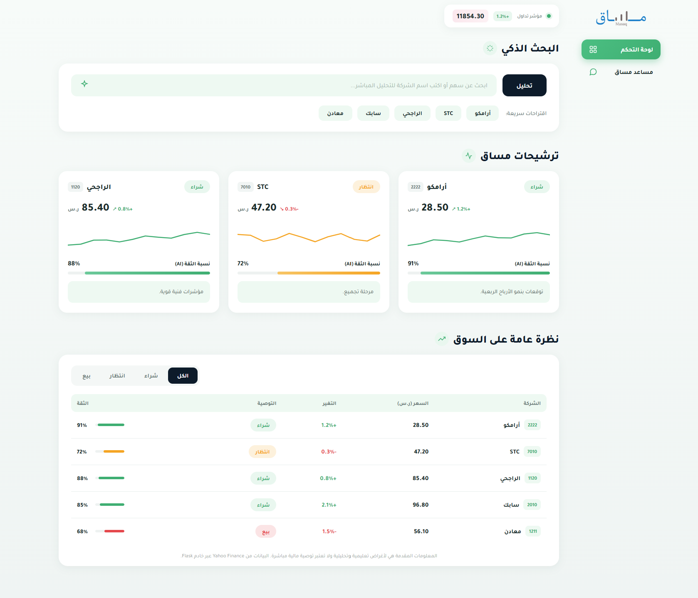
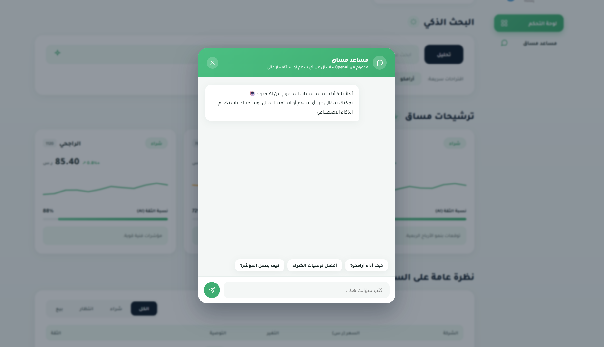

# مساق - مستشارك الاستثماري الذكي

مساق منصة ويب لتحليل الأسهم السعودية باستخدام الذكاء الاصطناعي، توفر تحليلاً فورياً للأسهم، توصيات استثمارية، ومساعداً ذكياً للإجابة عن الاستفسارات المالية.

## ✨ المميزات

- 📈 تحليل فوري للأسهم السعودية
- 🤖 مساعد ذكي للإجابة عن الاستفسارات
- 💹 توصيات شراء / بيع / انتظار مع نسبة ثقة
- 📊 بيانات مباشرة من Yahoo Finance
- 📱 تصميم متجاوب لجميع الأجهزة

## 📷 Screenshots

### الصفحة الرئيسية
واجهة تعريفية تعرض فكرة المنصة وتسمح بالانتقال إلى لوحة التحكم.


### لوحة التحكم
يمكن للمستخدم البحث عن أي سهم، عرض التحليل، التوصيات، وبيانات السوق.



### المساعد الذكي
التفاعل مع المساعد الذكي للحصول على إجابات وتحليلات مالية.



## 🛠 التقنيات المستخدمة

- HTML
- CSS
- JavaScript
- Python (Flask)
- yfinance
- OpenAI API

## ▶️ تشغيل المشروع

```bash
pip install -r requirements.txt
python app.py
```

ثم افتح المتصفح على:

```
http://127.0.0.1:5000
```

## 📌 ملاحظة

هذا المشروع لأغراض تعليمية، ولا يُعد توصية استثمارية مباشرة.
