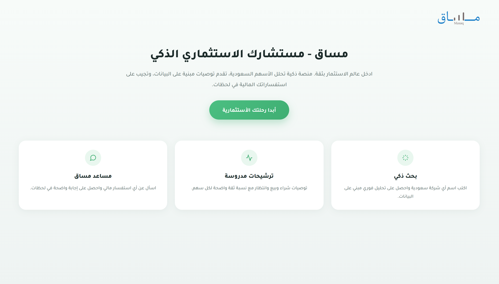
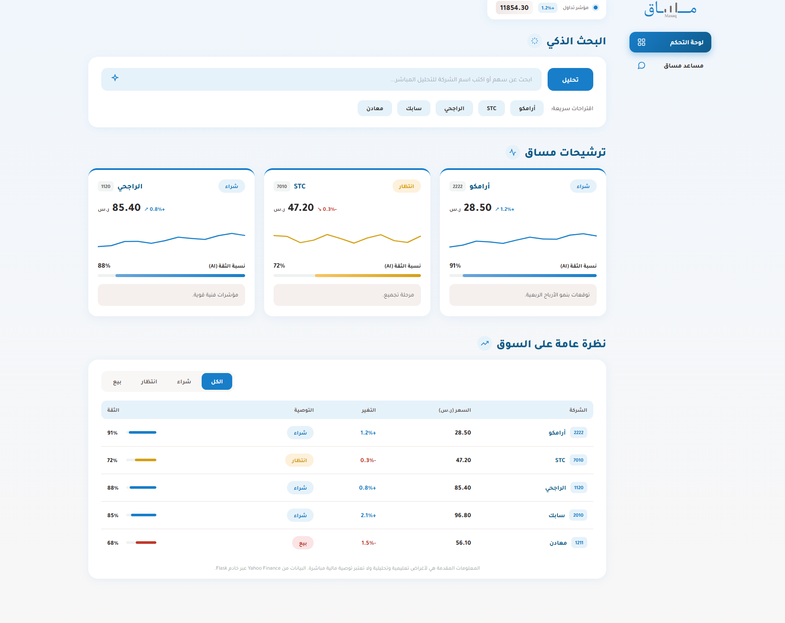
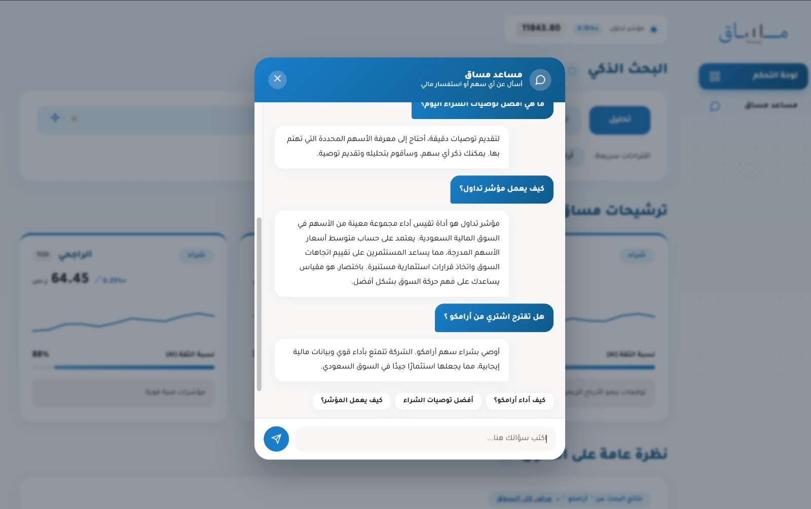

# مساق - مستشارك الاستثماري الذكي

مساق منصة ويب لتحليل الأسهم السعودية باستخدام الذكاء الاصطناعي، توفر تحليلاً فورياً للأسهم، توصيات استثمارية، ومساعداً ذكياً للإجابة عن الاستفسارات المالية.

## ✨ المميزات

- 📈 تحليل فوري للأسهم السعودية
- 🤖 مساعد ذكي للإجابة عن الاستفسارات
- 💹 توصيات شراء / بيع / انتظار مع نسبة ثقة
- 📊 بيانات مباشرة من Yahoo Finance
- 📱 تصميم متجاوب لجميع الأجهزة

## 📷 Screenshots

### الصفحة الرئيسية
واجهة تعريفية تعرض فكرة المنصة وتسمح بالانتقال إلى لوحة التحكم.

### لوحة التحكم
يمكن للمستخدم البحث عن أي سهم، عرض التحليل، التوصيات، وبيانات السوق.

### المساعد الذكي
التفاعل مع المساعد الذكي للحصول على إجابات وتحليلات مالية.

## 🛠 التقنيات المستخدمة

- HTML
- CSS
- JavaScript
- Python (Flask)
- yfinance
- OpenAI API
## طريقة التشغيل

1. تثبيت المتطلبات:
pip install -r requirements.txt

2. تشغيل الخادم:
python app.py

3. افتح ملف home.html في المتصفح.

ملاحظة:
إذا رغبت باستخدام ميزات OpenAI، أضف مفتاح API الخاص بك في ملف .env كالتالي:

OPENAI_API_KEY=your_api_key

## 📌 ملاحظة

هذا المشروع لأغراض تعليمية، ولا يُعد توصية استثمارية مباشرة.
